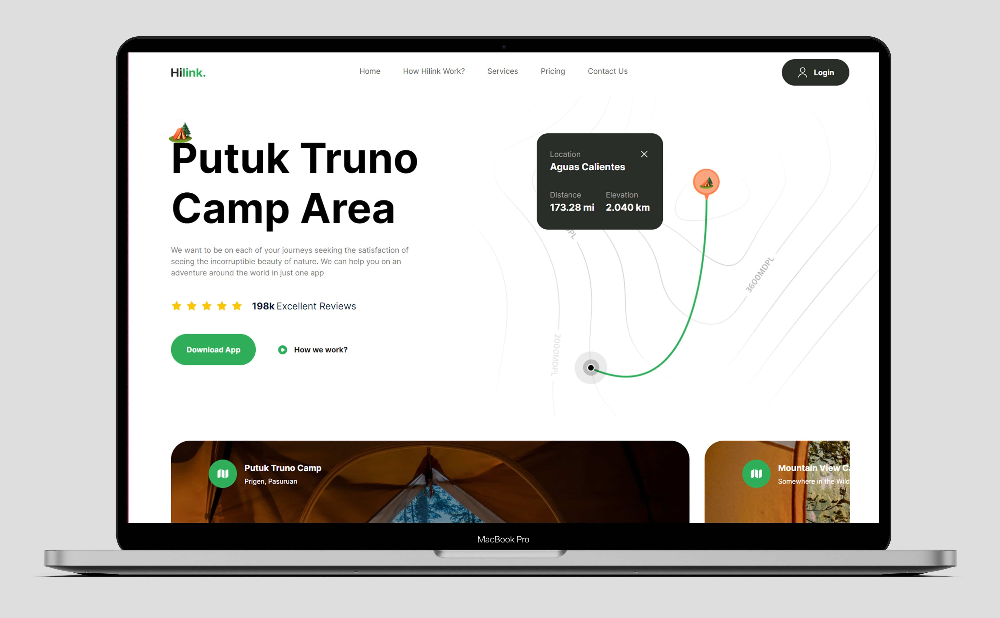

# Build and Deploy a Fully Responsive Modern UI/UX Website | React.js, Next.js 13, Tailwind CSS.


## Introduction
HILINK a feature-rich travel app with Next.js 13 and Tailwind CSS, covering everything from a sleek UI to mobile-first best practices.

## Features: 
- An appealing hero section
- A camp section featuring various camps to explore
- An engaging travel guide section
- A complex feature-rich section
- A call to action section for mobile apps
- And a big footer section with many site and social links

## Implementation:
- implement Next.js 13 most modern best practices
- improve your code architecture and make your components reusable
- utilize Tailwind CSS
- start with the mobile-first approach for maximum responsiveness
- make use of TypeScript
- and many more best practices that set you apart in the industry

 Learn from:
  ⭐ JSM Masterclass Experience - https://jsmastery.pro/masterclass


## Getting Started

This is a [Next.js](https://nextjs.org/) project bootstrapped with [`create-next-app`](https://github.com/vercel/next.js/tree/canary/packages/create-next-app).

First, run the development server:

```bash
npm run dev
# or
yarn dev
# or
pnpm dev
# or
bun dev
```

Open [http://localhost:3000](http://localhost:3000) with your browser to see the result.

You can start editing the page by modifying `app/page.tsx`. The page auto-updates as you edit the file.

This project uses [`next/font`](https://nextjs.org/docs/basic-features/font-optimization) to automatically optimize and load Inter, a custom Google Font.

## Learn More

To learn more about Next.js, take a look at the following resources:

- [Next.js Documentation](https://nextjs.org/docs) - learn about Next.js features and API.
- [Learn Next.js](https://nextjs.org/learn) - an interactive Next.js tutorial.

You can check out [the Next.js GitHub repository](https://github.com/vercel/next.js/) - your feedback and contributions are welcome!

## Deploy on Vercel

The easiest way to deploy your Next.js app is to use the [Vercel Platform](https://vercel.com/new?utm_medium=default-template&filter=next.js&utm_source=create-next-app&utm_campaign=create-next-app-readme) from the creators of Next.js.

Check out our [Next.js deployment documentation](https://nextjs.org/docs/deployment) for more details.
